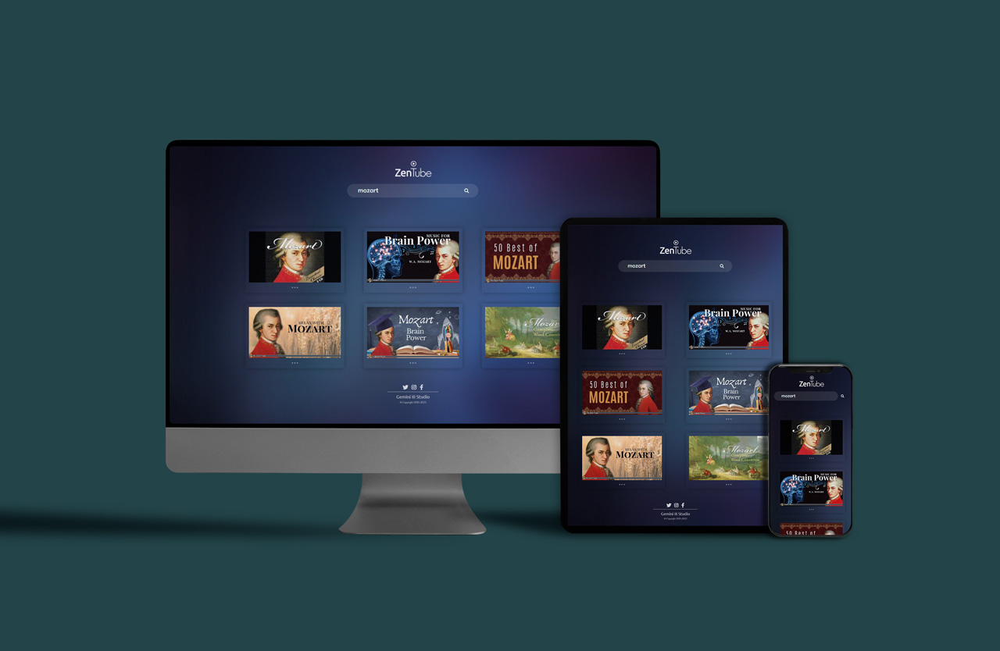

  
<br><br>

# ZenTube
### ZenTube é uma proposta  minimalista para o Youtube, usando a API oficial do Google.

<br>

<!-- >Site no ar: &nbsp; https://zen-tube.vercel.app -->

>Site no ar: <a href="https://zen-tube.vercel.app" target="_blank">&nbsp; https://zen-tube.vercel.app</a>

Obs.: Apenas a **primeira busca** poderá levar cerca de 45 segundos para responder. É um limite da hospedagem gratuita, que impõe esse atraso para tirar o servidor do _standby_.

<br><br>

## Como rodar localmente:

<br>

1. Obtenha gratuitamente sua _key_: &nbsp; https://developers.google.com/youtube/v3/getting-started?hl=pt-br

2. Na pasta _server_, crie um arquivo chamado **.env** e escreva dentro dele:
```javascript
    API_KEY_ENV="cole sua key do Youtube API"
```
3. Pelo terminal, entre na pasta _server_, instale as dependências e suba o servidor:
```
    cd server
```
```
    npm install
```
```
    npm run dev
```

4. Na pasta **client/src**, no arquivo **SearchInput.jsx**, substitua a linha 12 por:
```javascript
    const FETCH_URL = `http://localhost:3000?term=${searchTerm}`
```
5. Abra um segundo terminal (sem fechar o outro terminal).

6. Entre na pasta _client_, instale as dependências e rode o _app_:
```
    cd client
```
```
    npm install
```
```
    npm run dev
``` 
7. No terminal, em uma das linhas de resposta virá um URL, como esse de exemplo:
```
    ➜  Local:   http://localhost:5173/
```
8. Dê (_control_ + clique) no link, ou digite no navegador o endereço que estiver no seu terminal.
```
    http://localhost:5173/
```
